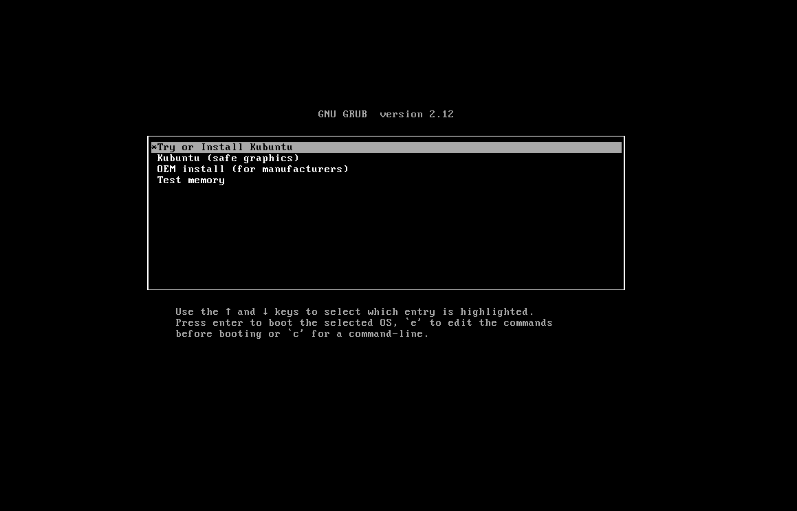
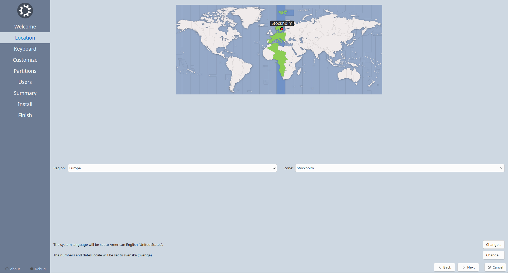
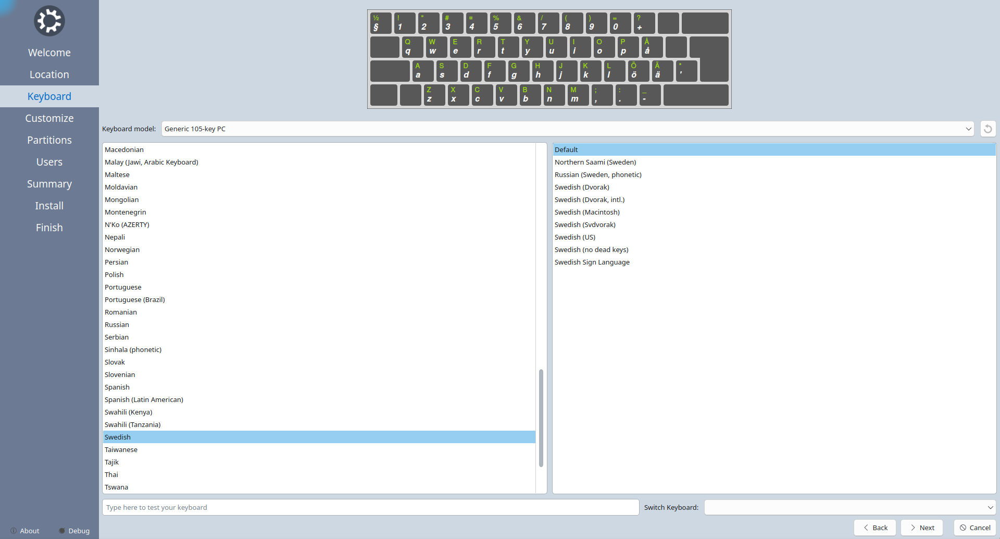
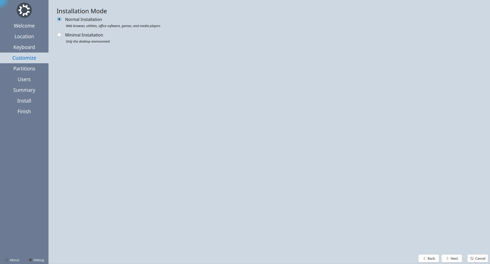
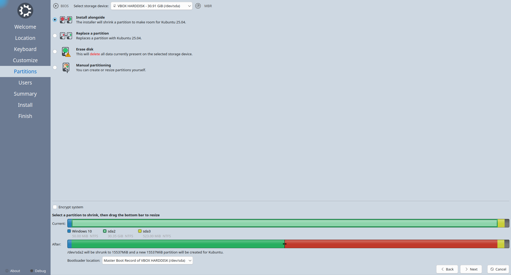
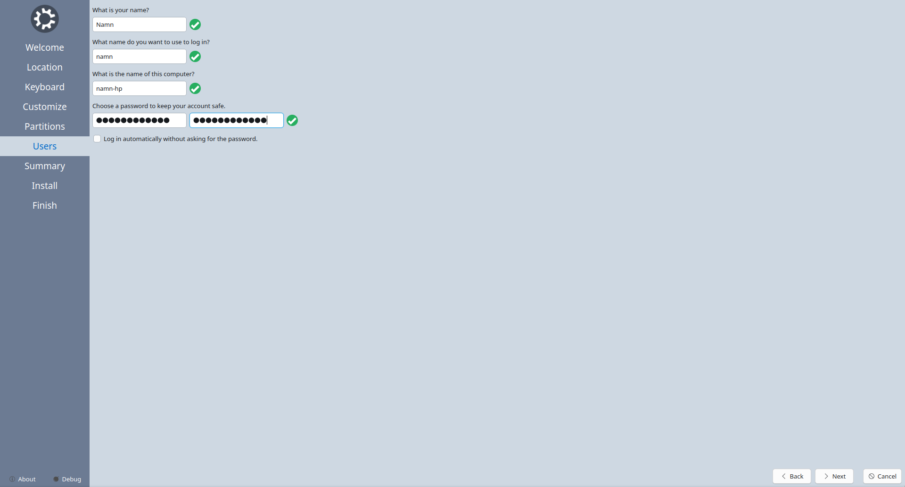
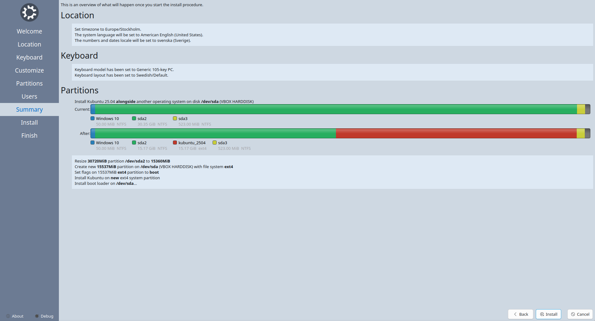

# Hur man skapar dual boot med Kubuntu och Windows 

## Innan du börjar  
Sätt i strömkabel in i datorn

## Installation
### Stäng av Secure Boot
- Stäng av datorn helt
- Sätt på datorn och tryck upprepat på F10
- Navigera till 'Security' > 'Secure Boot Configuration'
- Stäng av Secure Boot
- Gå tillbaka till 'Main'

### Boota installationsmediat
- Sätt i USB-stickan
- Välj 'Save Changes and Exit', sedan 'Yes'
- Tryck upprepat på F9
	- Om Windows startas har du misslyckats och behöver starta om datorn och åter trycka F9.
- Välj 'UEFI - Kingston DataTraveler [...]'
- Välj 'Try or Install Kubuntu'


### Vad du väljer under installationen
- För nätverksanslutning, välj 'WiFi tcstenungsund' och skriv i lösenordet
- Klicka 'Install Kubuntu'
- Välj Europe, Stockholm som tidszon

- För tangentbordslayout, välj 'Swedish' och 'Default'

- Välj 'Normal Installation'

- Välj 'Install alongside' och tryck på 'nvme0n1p3', välj att använda ungefär hälften av partitionen

- Fyll i uppgifterna i användarformuläret

- Verifiera att samtlig information överensstämmer med tidigare instruktioner och välj därefter 'Install'


---

## Efter installationen 
Det är några saker som du ska göra efter att du har installerat Kubuntu, och det är:
1. Ändra skalan på skärmen (frivilligt)
2. Installera Firefox Developer Edition
3. Installera VSCodium
4. Installera Git

### 1. Ändra skalan på skärmen (frivilligt)  
Det första du bör göra efter att du är klar med installationen är att kolla så att skalan på skärmen är rätt.
1. Tryck på **Windows-tangenten** och sök efter *System Settings*.
2. Gå in på *Settings* under *Input & Output* och navigera till *Display & Monitor*.
3. Under *Display & Monitor*, kontrollera att skalan (*Scale*) är satt på **100%**.

### 2. Installera Firefox Developer Edition  
- Öppna terminalen (ALT+CTRL+T). Använd **CTRL+SHIFT+V** för att klistra in nedanstående kommandon i terminalen.
- Skapa en katalog för att lagra APT-arkivets nycklar:
```
sudo install -d -m 0755 /etc/apt/keyrings
```
- Importera Mozilla APT-arkivets signeringsnyckel:
```
wget -q https://packages.mozilla.org/apt/repo-signing-key.gpg -O- | \
sudo tee /etc/apt/keyrings/packages.mozilla.org.asc > /dev/null
```
- Fingeravtrycket ska vara (35BAA0B33E9EB396F59CA838C0BA5CE6DC6315A3). Du kan kontrollera det med följande kommando:
```
gpg -n -q --import --import-options import-show \
/etc/apt/keyrings/packages.mozilla.org.asc | awk '/pub/{getline; \
gsub(/^ +| +$/,""); if($0 == \
"35BAA0B33E9EB396F59CA838C0BA5CE6DC6315A3") print "\nThe key \
fingerprint matches ("$0").\n"; else print "\nVerification failed: \
the fingerprint ("$0") does not match the expected one.\n"}'
```
- Lägg till Mozilla APT-arkivet i din källlista:
```
echo "deb [signed-by=/etc/apt/keyrings/packages.mozilla.org.asc] \
https://packages.mozilla.org/apt mozilla main" | sudo tee -a \
/etc/apt/sources.list.d/mozilla.list > /dev/null
```
- Konfigurera APT för att prioritera paket från Mozilla-arkivet:
```
echo '
Package: *
Pin: origin packages.mozilla.org
Pin-Priority: 1000
' | sudo tee /etc/apt/preferences.d/mozilla
```
- Uppdatera paketlistan och installera Firefox .deb-paketet:
```
sudo apt-get update && sudo apt-get install firefox-devedition
```
Nu bör **Firefox Developer Edition** vara installerad.

### 3. Installera VSCodium
- Öppna en terminal i Kubuntu och använd följande kommando för att hämta utvecklarens GPG-signaturnyckel och lägga till den i ditt system. På så sätt kommer ditt Kubuntu-system att lita på de paket som är signerade av denna utvecklare.
```
sudo wget \
https://gitlab.com/paulcarroty/vscodium-deb-rpm-repo/raw/master/pub.gpg \
-O /usr/share/keyrings/vscodium-archive-keyring.asc
```
- Nästa steg är att lägga till arkivet i systemets sources.list-fil. På så sätt vet ditt Kubuntu-system varifrån det ska hämta paketet.
```
echo 'deb [ signed-by=/usr/share/keyrings/vscodium-archive-keyring.asc \
] https://paulcarroty.gitlab.io/vscodium-deb-rpm-repo/debs vscodium \
main' | sudo tee /etc/apt/sources.list.d/vscodium.list
```
- Uppdatera den lokala paketcachen så att ditt system är medvetet om paketen från det nyligen tillagda arkivet.
```
sudo apt update
```
- Nu är du redo att installera VSCodium på Kubuntu:
```
sudo apt install codium
```

### 4. Installera Git
Git bör vara installerat från början. Verifiera detta med detta kommando i terminalen:
```
git --version
```
Om terminalen skriver ut en Git-version är Git installerat och du är klar. Får du inte en Git-version, installera Git:
```
sudo apt-get install git
```
